<div align="center">

<h1>Kinema</h1>

**A topic goes in. A finished film comes out.**

Kinema turns a brief into a production-ready film, bringing research, writing, shot design,
character development, images, voice, subtitles, effects and final assembly into one workflow.

<p>
  <a href="LICENSE"></a>
  
  
  
</p>
<p>
  <a href=".claude/skills/"></a>
  <a href="AGENTS.md"></a>
  
  
</p>

[English](README.md) · [简体中文](README.zh-CN.md)


</div>

---

AI video production still means moving between separate tools for writing, storyboards,
images, voice, video and editing. Character and location references are easily scattered
across sessions, so one change can force much of the downstream work to be rebuilt.
**Kinema brings those stages into one production pipeline, with assets that remain reusable,
traceable and reversible across an entire series.**

- ✍️ **Long-form fiction** — ten chapters per batch, followed by a **seven-part review**
  (canon · characterisation · continuity · AI artefacts · prose voice · foreshadowing ·
  pacing). Character voices, props, arc outlines and planted threads stay current as the
  story develops. Start from scratch or continue an unfinished manuscript.
- 🎬 **Novel into script, script into shot list** — a chapter becomes an episode, every shot
  carrying bilingual prompts; a zero-cost static review flags repeated camera moves, flat
  framing and AI slop before you have spent anything.
- 🎥 **A 3D directing stage** — block the scene with grey models before production: staging,
  action and **30+ camera-move presets**, including more than a dozen signature moves, rendered
  into reproducible previz.
- ✏️ **Pencil storyboards** — a shot cut into timed actions, drawn as a rough board with a
  per-second timeline alongside it. The video model gets an exact schedule instead of one
  vague sentence.
- 🎞️ **Depth capture** — a live-action clip becomes a person depth relief plus skeleton
  control video on your CPU; bind a 4–15 s segment to a shot and the video model follows
  its motion while the look comes from your design sheets. The source track can score the
  chapter; the offset between clip and footage is measured and, when the match is confident,
  compensated. Optional perception stack, see [`SETUP.md`](SETUP.md).
- 🎭 **Character sheets** — three-zone character sheets (portrait close-up plus front and
  back full-body views), structural three-view prop sheets and location key art,
  attached to each shot from its cast and scene bindings. These references keep faces, props
  and locations consistent across shots.
- 🎨 **Style presets** — cyberpunk · Shinkai · Ghibli · wuxia · 3D donghua · Pixar ·
  Disney 3D · photoreal CG · Western comics · ink wash · claymation · miniature · pixel art ·
  virtual production. Switch profiles and the visual language changes as a whole.

Each stage writes its output to disk and waits for your approval before the next begins;
cloud and self-hosted models are freely configurable.
**The engine runs on your machine, the keys are yours, and so are the films.**

## 🎬 System Interface

Kinema automates execution while leaving creative decisions and approvals with you. Its
production console follows the same order as the actual workflow.

<table>
  <tr>
    <td width="50%" valign="top">
      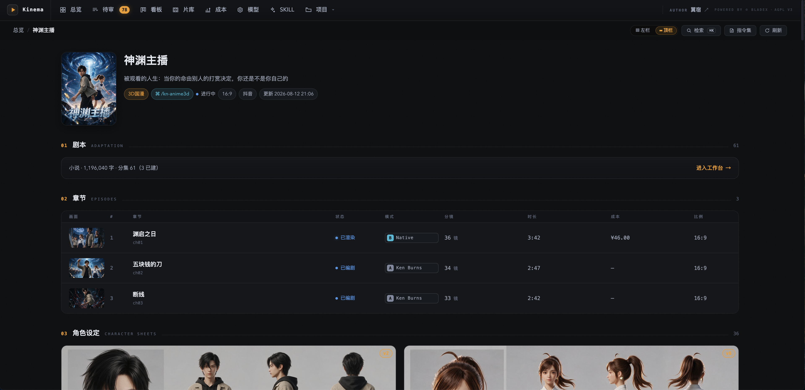
      <p align="center"><em><b>Project</b> — a whole series on one page: the source novel, every episode with its render mode, shot count, runtime and actual spend, and the cast underneath</em></p>
    </td>
    <td width="50%" valign="top">
      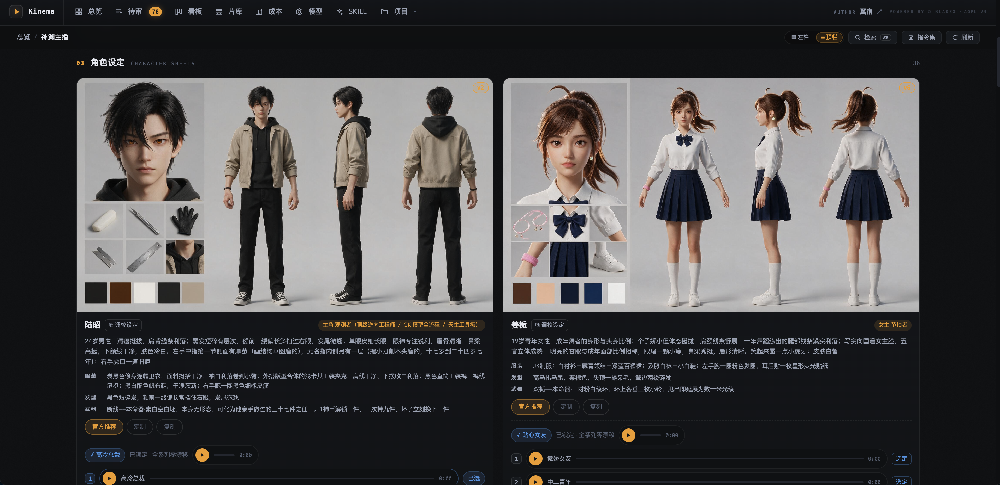
      <p align="center"><em><b>Character sheets</b> — a three-zone sheet per character: a portrait close-up plus front and back full-body views, with the locked voice auditioned right on the card</em></p>
    </td>
  </tr>
  <tr>
    <td width="50%" valign="top">
      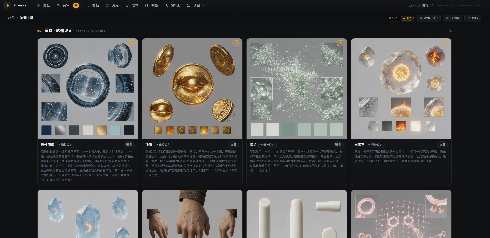
      <p align="center"><em><b>Prop sheets</b> — a structural three-view sheet for every prop with material and lighting notes, so the same object reads identically across shots</em></p>
    </td>
    <td width="50%" valign="top">
      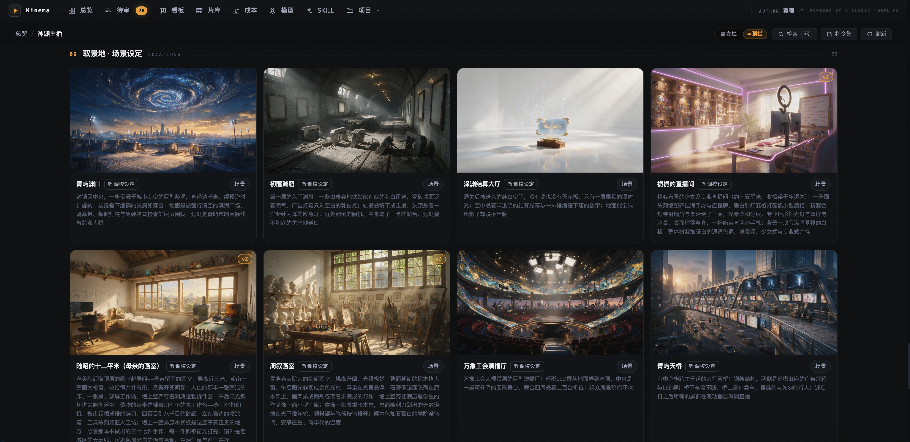
      <p align="center"><em><b>Location sheets</b> — key art for every location with material and lighting notes, so the same place reads identically across shots</em></p>
    </td>
  </tr>
  <tr>
    <td width="50%" valign="top">
      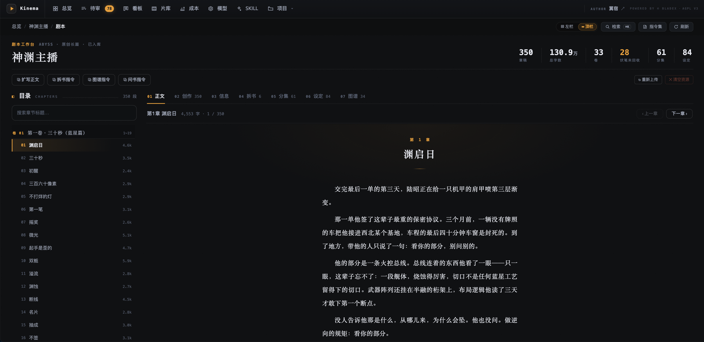
      <p align="center"><em><b>Script workbench</b> — the novel comes first: 350 chapters and 1.3M words, chapter tree on the left, prose on the right, adaptation directives one click away</em></p>
    </td>
    <td width="50%" valign="top">
      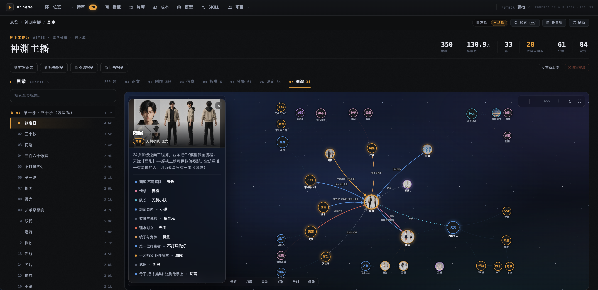
      <p align="center"><em><b>Relationship graph</b> — characters, factions, locations, artefacts and lore in one graph, with typed links for kinship, alliance, mentorship, hostility, romance, allegiance and rivalry. Continuity can be inspected instead of reconstructed from memory</em></p>
    </td>
  </tr>
  <tr>
    <td width="50%" valign="top">
      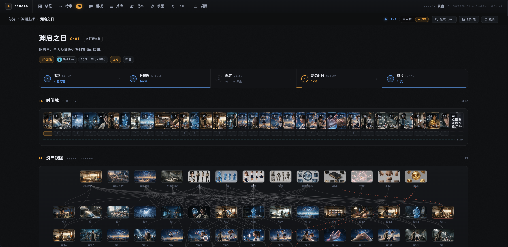
      <p align="center"><em><b>Chapter workbench</b> — five gates across the top (script → stills → voice → motion → cut), the timeline beneath, and asset lineage below that: change one sheet and every downstream shot is marked stale</em></p>
    </td>
    <td width="50%" valign="top">
      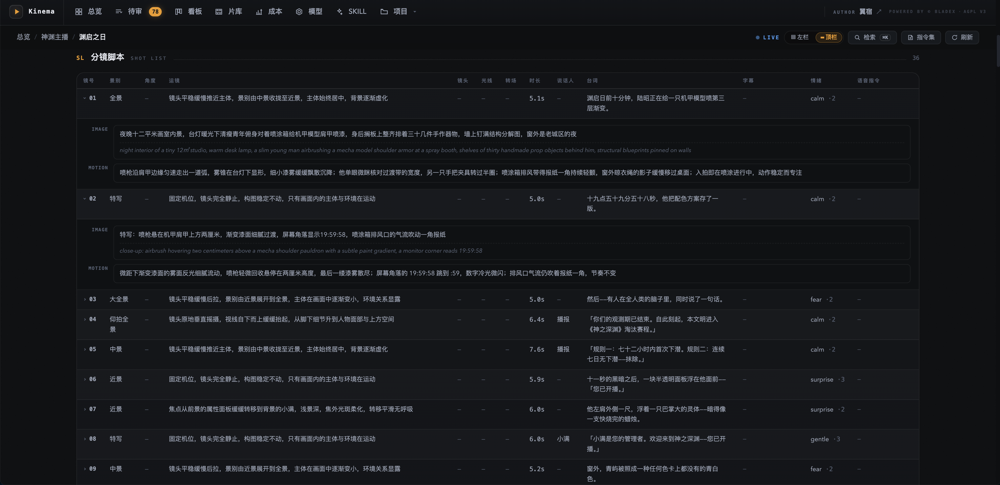
      <p align="center"><em><b>Shot list</b> — one row per shot: size, camera move, duration, line, emotion, and the image and motion prompts in full</em></p>
    </td>
  </tr>
  <tr>
    <td width="50%" valign="top">
      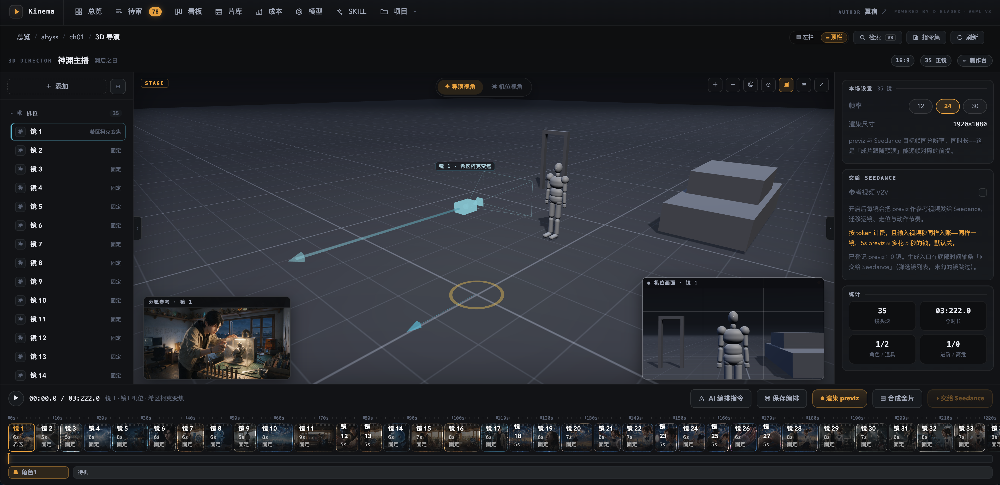
      <p align="center"><em><b>3D directing stage</b> — block staging, action and camera movement with grey models, then render the result as reproducible previz; 30+ presets include more than a dozen signature moves</em></p>
    </td>
    <td width="50%" valign="top">
      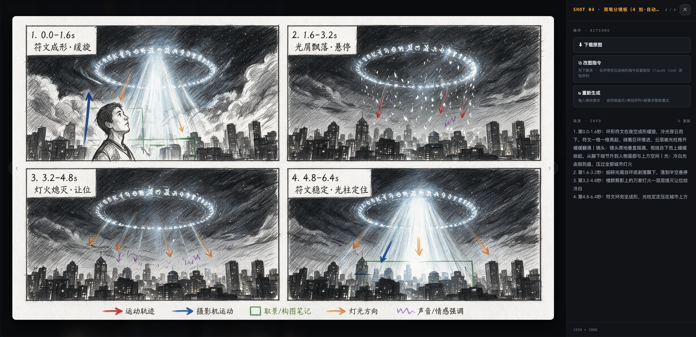
      <p align="center"><em><b>Sketch storyboard</b> — a shot cut into timed beats, drawn as a pencil board with a colour-coded legend — motion path, camera move, framing, light, sound — and a per-second script handed to the video model</em></p>
    </td>
  </tr>
  <tr>
    <td width="50%" valign="top">
      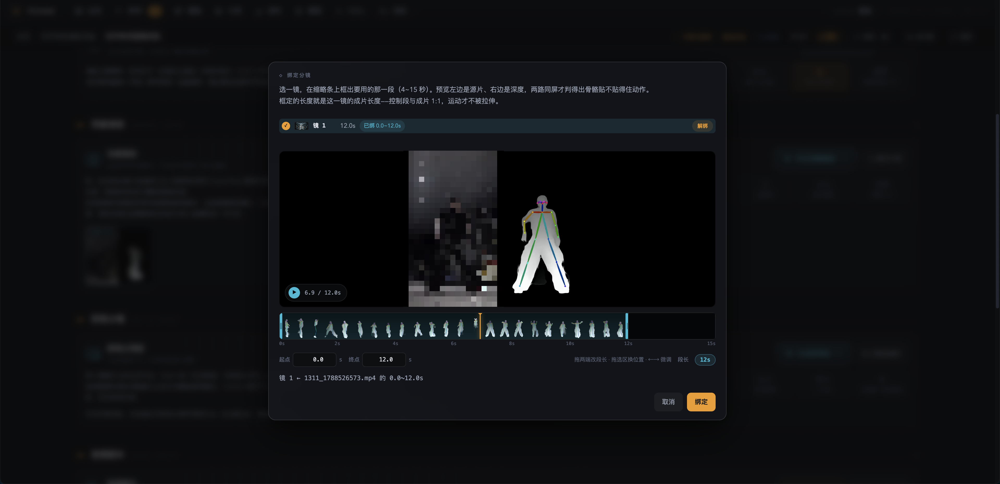
      <p align="center"><em><b>Depth capture · binding</b> — upload a live-action clip and the machine extracts a person depth relief and skeleton into a control video; frame a 4–15 s segment on the strip and bind it to a shot, the segment length becomes the shot length, source and depth previewed side by side</em></p>
    </td>
    <td width="50%" valign="top">
      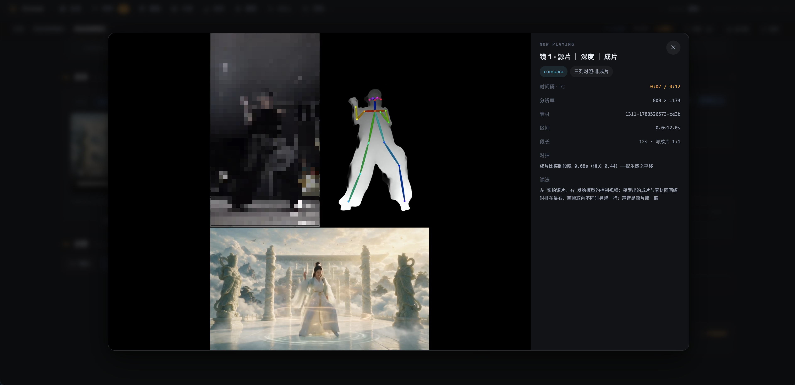
      <p align="center"><em><b>Depth capture · three-up compare</b> — source, control video and generated clip aligned frame by frame over the same interval, sound from the source; the engine measures the clip's offset against the control segment and shifts the score when the match is confident — motion from footage, look from the design sheets</em></p>
    </td>
  </tr>
  <tr>
    <td width="50%" valign="top">
      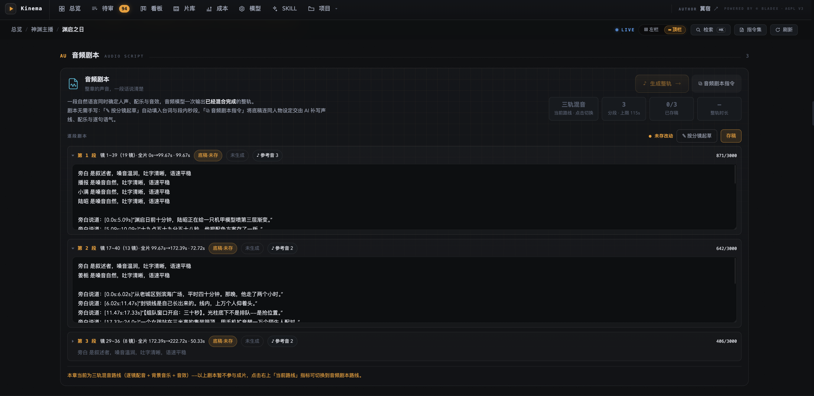
      <p align="center"><em><b>Audio script</b> — a structured plan for the chapter's sound, with voice direction, dialogue, per-segment timing and line-level reference audio; drafted from the shot list and rendered by the generative audio model as a single track</em></p>
    </td>
    <td width="50%" valign="top">
      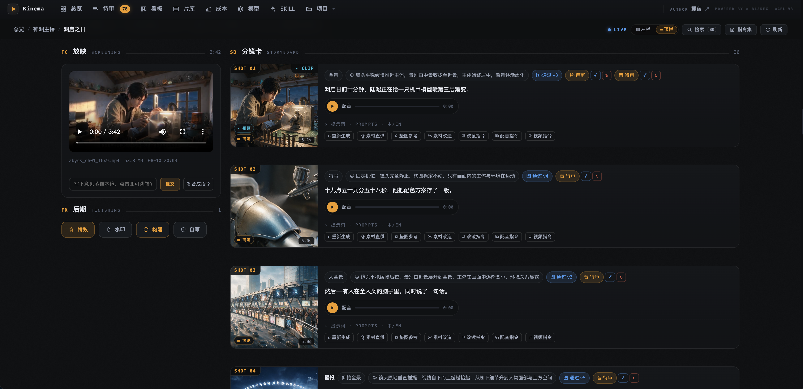
      <p align="center"><em><b>Storyboard and screening</b> — image, voice and motion clip reviewed independently per shot, the assembled cut playing alongside; one click copies a shot-revision brief for the agent</em></p>
    </td>
  </tr>
</table>

## 🚀 Quick Start

The only hard dependency is **FFmpeg**. The engine core has zero Python dependencies and
the mock pipeline runs fully offline.

```bash
brew install ffmpeg       # macOS · Debian: sudo apt install ffmpeg

cd engine
python3 -m kinema doctor  # check ffmpeg, config, providers, storage backend

# End-to-end offline at zero cost: placeholder art and synthesized audio
# exercise every stage of the real pipeline
cp examples/sample_project.json /tmp/demo.json
python3 -m kinema run --project /tmp/demo.json --mock

python3 -m kinema studio  # open the console → http://127.0.0.1:8787
```

## 🎞️ How a Film Gets Made

Call the relevant style playbook from your coding agent to begin production:

```
/kn-cyberpunk a lone merc breaches floor 47 — one corridor, twelve guards, tactical system at 80% damage
```

The underlying workflow is shown below. **Every gate writes its output to disk and waits for
approval**; only an explicit `kinema run` continues through the full pipeline:

```bash
python3 -m kinema project new --title "Blade & Rain" --id bladerain --profile cyberpunk
python3 -m kinema chapter new bladerain --title "Floor 47"  # → ch01
#   ↑ the agent takes over here: script, shot breakdown, bilingual prompts

python3 -m kinema project refs bladerain                       # design sheets — the consistency foundation
python3 -m kinema lint      --chapter bladerain/ch01           # free static review: repeated moves, flat framing, slop
python3 -m kinema gen-image --chapter bladerain/ch01 --only 1  # first shot only — lock the look before spending
python3 -m kinema tts       --chapter bladerain/ch01           # narration in the cast's custom voices
python3 -m kinema animatic  --chapter bladerain/ch01           # full-length Ken Burns animatic for pacing review — zero video cost

python3 -m kinema gen-video --chapter bladerain/ch01 --dry-run        # quote every shot before spending
python3 -m kinema gen-video --chapter bladerain/ch01 --approved-only  # render only what you approved
python3 -m kinema assemble  --chapter bladerain/ch01                  # final cut
#   the render mode follows the content (dialogue → native, narration-only → dubbed);
#   --native / --dubbed / --kenburns override it for the run
```

## 🧭 Why Kinema

| Claim | Evidence |
|---|---|
| 💰 **Know the cost before generation** | `--dry-run` quotes every shot; shots marked `done` remain locked even under `--force`; if a batch exceeds `budget`, the pre-flight gate sends **no requests**. Estimated and actual spend are tracked separately. |
| 🎭 **Consistency through assets and lineage** | Three-zone character sheets, structural three-view prop sheets and location key art are attached per shot; fixed seeds and asset lineage mark downstream shots stale as soon as a source sheet changes. Identity is established before motion is generated. |
| 🏭 **Studio-grade review workflow** | Five-state review × version stack × pixel-anchored notes × contact-sheet selection × region-scoped revision × cross-shot batch edits. The agent proposes; you approve, revise or roll back. |
| 💻 **An ordinary laptop is enough** | Heavy lifting happens in cloud APIs. Locally it is only FFmpeg compositing, subtitles and camera moves — **CPU only, no GPU required**. |
| 🔌 **Swap models without changing the pipeline** | Code binds to capabilities (image / video / speech / music), not vendors. Add a model alias in `models.yaml`, or change the default provider in one place; every style profile follows the same routing. |
| 🤖 **Works across coding agents** | `AGENTS.md` is the canonical engineering guide for Claude Code, Codex, Cursor, Copilot, Windsurf, Aider and Zed. Tool-specific files remain thin entry points to the same rules. |

## 🎛️ Render Modes

The render mode is set once per chapter. Leave it unset and the engine reads the content:
a chapter with on-screen dialogue goes **native**, a narration-only chapter goes **dubbed**,
a chapter driven by an audio script goes native. Ken Burns is never assumed; ask for it with
`--kenburns` when you want a zero-cost cut.

| Mode | Picture | Sound | Video cost |
|---|---|---|---|
| **kenburns** | Eased camera moves over stills | Kinema TTS narration + score | **none** |
| **dubbed** | Seedance image-to-video, closed-lip performance timed to the narration | Kinema TTS narration + score | metered |
| **native** | Seedance native audio-visual; each speaker's cast voice rides along as reference audio, so lip movement, lines and timbre come from one generation | The model's own voice track. TTS narration for narration-only shots is opt-in per chapter (`native_voiceover`, or `assemble --burn-voice` for a single run) | metered |

## 🎨 Models and Styles

Models and styles are configured centrally in **`config/models.yaml`**, with more than a dozen
provider aliases included:

| Capability | Primary | Alternates |
|---|---|---|
| Image | Seedream | Nano Banana · Wan · MiniMax |
| Video | Seedance 2.0 mini / 2.5 | Veo · MiniMax H3 |
| Speech | seed-audio-1.0 custom voices built from a written voice brief (default) · seed-tts-2.0 template voices | MiniMax |
| Music | ElevenLabs | MiniMax · bundled CC0 library — automatic fallback with no key |

Beyond that: **40+ style profiles**, **10+ effects**, **zero-cost transitions** with CC0
sound design, **30+ camera-move presets** (including more than a dozen signature moves), and
subtitle layouts that follow the chosen style.

## 📚 Capability Playbooks

Kinema's workflow guides live under [`.claude/skills/`](.claude/skills/). They cover story
breakdown, style-specific prompting and voice direction.

- **Claude Code** discovers them automatically: `/kn-anime`, `/kn-explainer`, `/kinema-novel`…
- **Every other agent** reads them through [`docs/skills/INDEX.md`](docs/skills/INDEX.md),
  which indexes the same content in tool-neutral form.

`kinema` defines the shared production workflow; specialised playbooks build on it.

## 🗂️ Project Structure

```text
Kinema/
├── .claude/skills/          # the playbooks — single source, edited in place (frontmatter machine-managed)
├── .agents/skills           # alias link → .claude/skills (Codex · Gemini CLI · Amp · OpenCode)
├── .cursor/ · .github/      # thin pointers for Cursor and Copilot; they only point at AGENTS.md
├── agent/                   # the control plane, single-sourced (compile pipeline: agent/README.md)
│   ├── manifest.json        # skill registry: name · description · kind · status · permissions
│   ├── contracts.json       # machine contract source: PromptSpec / ChapterPlan
│   └── adapters/            # host entry templates → CLAUDE.md · .cursor/rules · copilot-instructions
├── assets/                  # repository asset collection
├── config/                  # models and styles · voices · audio · templates · storage · brand
├── docs/
│   ├── agents/              # detail layer for the guide — indexed by AGENTS.md, read on demand
│   ├── kinema/              # architecture overview design.md · pipeline walkthrough video-pipeline.md · data contract · provider matrix
│   ├── skills/              # tool-neutral skill index INDEX.md (generated, do not hand-edit)
│   └── sql/                 # MySQL schema script (generated by `db schema`, do not hand-edit)
├── engine/
│   ├── kinema/              # 100+ Python modules · the execution engine (no LLM inside)
│   │   ├── assets/          # bundled fonts · layout blueprints for sheets and sketch boards
│   │   ├── control/         # depth capture: footage → control video → binding · compares · source-track score · motion sync
│   │   ├── pipeline/        # image · voice · subtitles · camera · transitions · mix · compose
│   │   ├── providers/       # vendor adapters, one file per capability × vendor
│   │   ├── storage/         # local JSON ⇄ MySQL ⇄ object storage
│   │   ├── studio/          # console backend (scanner · server · jobs · actions)
│   │   ├── studio_app/      # console frontend, native ESM, no build step (app/ console · director/ 3D stage)
│   │   └── cli.py           # 50+ subcommands · final authority on command behaviour
│   ├── examples/            # runnable sample project.json
│   └── tests/               # 2,000+ offline guard cases
├── music/                   # bundled CC0 score and SFX (media not in git, rebuilt by music/download.py)
├── tools/                   # agent_assets.py control-plane compiler · agents_alias.py Windows link repair
├── project/                 # workspace output — your project data lands here (gitignored)
├── AGENTS.md · CLAUDE.md    # the engineering guide, canonical for every agent · Claude Code pointer
├── SETUP.md · DEVELOP.md    # first run and readiness · full architecture and extension recipes
└── LICENSE                  # GNU AGPL v3
```

## 📄 Documentation

| Document | Contents |
|---|---|
| [`AGENTS.md`](AGENTS.md) | **The Agent Kernel** — architecture boundaries, invariants and the per-module reading map. Loaded by every agent |
| [`DEVELOP.md`](DEVELOP.md) | **Developer guide** — module map, full CLI reference and extension recipes, kept in sync with the codebase by automated tests |
| [`SETUP.md`](SETUP.md) | First-run install and readiness checks |
| [`docs/kinema/design.md`](docs/kinema/design.md) | **Architecture overview** — layers, pipeline, consistency, sound and cost on one page, with the founding trade-off archive |
| [`docs/kinema/video-pipeline.md`](docs/kinema/video-pipeline.md) | **Pipeline walkthrough** — document, state and concurrency model, then every stage in data-flow order with its predicates, products, gates and write-backs |
| [`docs/skills/INDEX.md`](docs/skills/INDEX.md) | The capability playbooks, tool-neutral index |
| [`config/README.md`](config/README.md) | Field-level reference for every config file, and how to swap models |
| [`docs/kinema/project.schema.json`](docs/kinema/project.schema.json) | The `project.json` data contract |
| [`docs/kinema/providers.md`](docs/kinema/providers.md) | Per-vendor capabilities, pricing and limits |
| [`engine/kinema/cli.py`](engine/kinema/cli.py) | **The final authority on command behaviour** when docs and code disagree |

## 📜 Acknowledgements

- **[FFmpeg](https://ffmpeg.org/)** — the only hard dependency, and the engine behind every
  local composite, camera move, subtitle burn and loudness pass.
- **[Three.js](https://threejs.org/)** — vendored under MIT to drive the 3D directing stage;
  see [`engine/kinema/studio_app/vendor/NOTICE.md`](engine/kinema/studio_app/vendor/NOTICE.md).
- **[FreePD](https://freepd.com/)** and **[Freesound](https://freesound.org/)** — the CC0
  sources behind the bundled 100+ track score and 18-effect library, logged file by file in
  [`music/ATTRIBUTION.md`](music/ATTRIBUTION.md).
- **[Depth capture](.claude/skills/kinema-depth/SKILL.md)** — turns live-action footage into
  a person depth relief plus OpenPose-18 skeleton control video, entirely on the local CPU;
  only that control clip reaches the video model, as a motion reference. Built on three
  open-source perception models, all Apache-2.0:
  - **[RTMPose](https://github.com/open-mmlab/mmpose/tree/main/projects/rtmpose)** via **[rtmlib](https://github.com/Tau-J/rtmlib)** — 2D pose estimation and skeleton binding.
  - **[Depth Anything V2](https://github.com/DepthAnything/Depth-Anything-V2)** Small ([ONNX export](https://github.com/fabio-sim/Depth-Anything-ONNX)) — monocular relative depth.
  - **[MediaPipe](https://github.com/google-ai-edge/mediapipe)** selfie multiclass segmentation — person mask.

  Inference runs on **[ONNX Runtime](https://onnxruntime.ai/)** (MIT) and
  **[OpenCV](https://opencv.org/)** (Apache-2.0), installed as plain pip wheels; see
  [`SETUP.md`](SETUP.md).

## ⚖️ License

Kinema is released under the [**GNU AGPL v3**](LICENSE).

- **Free for individuals** — personal use, study, research and evaluation cost nothing and
  require no permission.
- **Closed-source commercial use** — a hosted service, an embedded or OEM product, an
  internal platform that will not be open sourced — requires a commercial license.

**Commercial licensing & agent customisation** ｜ [bladex.cn](https://bladex.cn) ｜ bladejava@qq.com

---

<div align="center">

**Kinema** · Copyright (C) 2018-2099 [BladeX](https://bladex.cn) · [AGPL v3](LICENSE)

</div>
